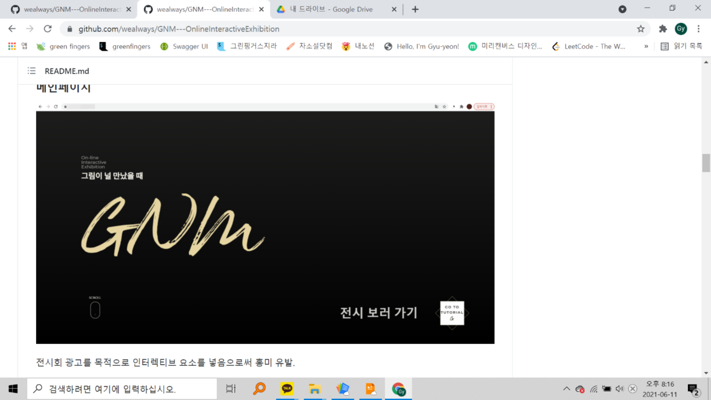
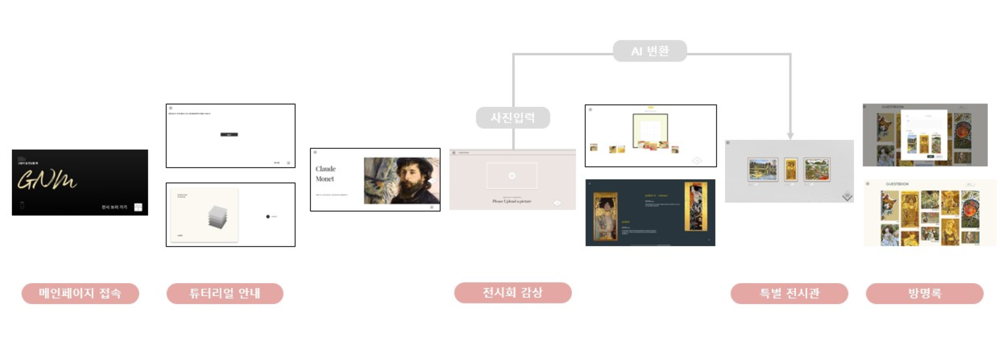

# 그림이 널 만났을 때

> 그림에 관심이 없는 사람들이 쾌적한 UI/UX, 화풍 변환 AI 기술로 쉽고 재밌게 그림을 이해하고 즐길 수 있는 온라인 인터랙티브 전시회입니다. 

> 팀원

김규연, 김다민, 박다솔, 최규수, 황승주

> 사용기술

#### Front-end

Vue.js, Vuex, Quasar, GSAP, Javascript

#### Back-end

Python, Django, sqlite3

> UserCase

> 담당 파트

Frontend를 담당하여 인터랙티브한 UI/UX를 구현하였습니다. 

> 성과

프로젝트를 하며 Javascript와 GSAP을 이용하여 화면을 동적으로 움직이는 것에 능숙해질 수 있었습니다. Vuex를 활용하여 화면에 자주 쓰이는 요소들을 컴포넌트화 하였습니다. 결과적으로 완성도 높은 온라인 인터랙티브 전시회 페이지를 제작할 수 있었습니다. 

